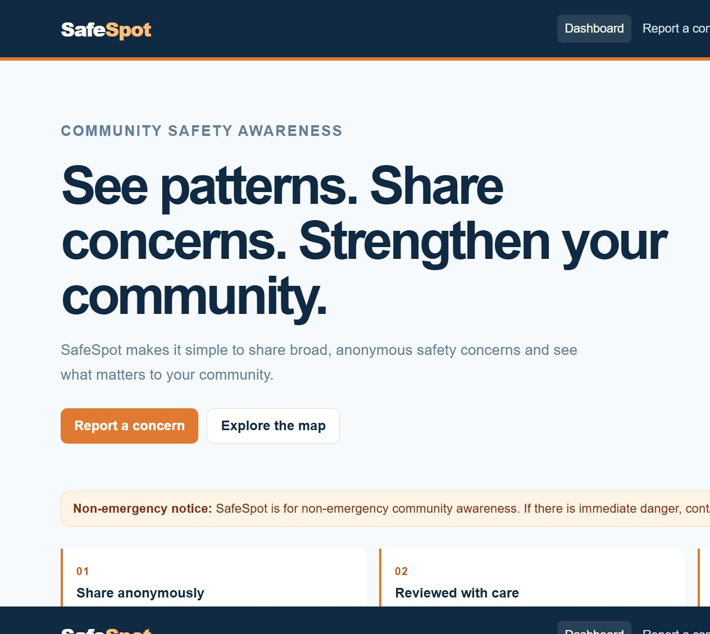
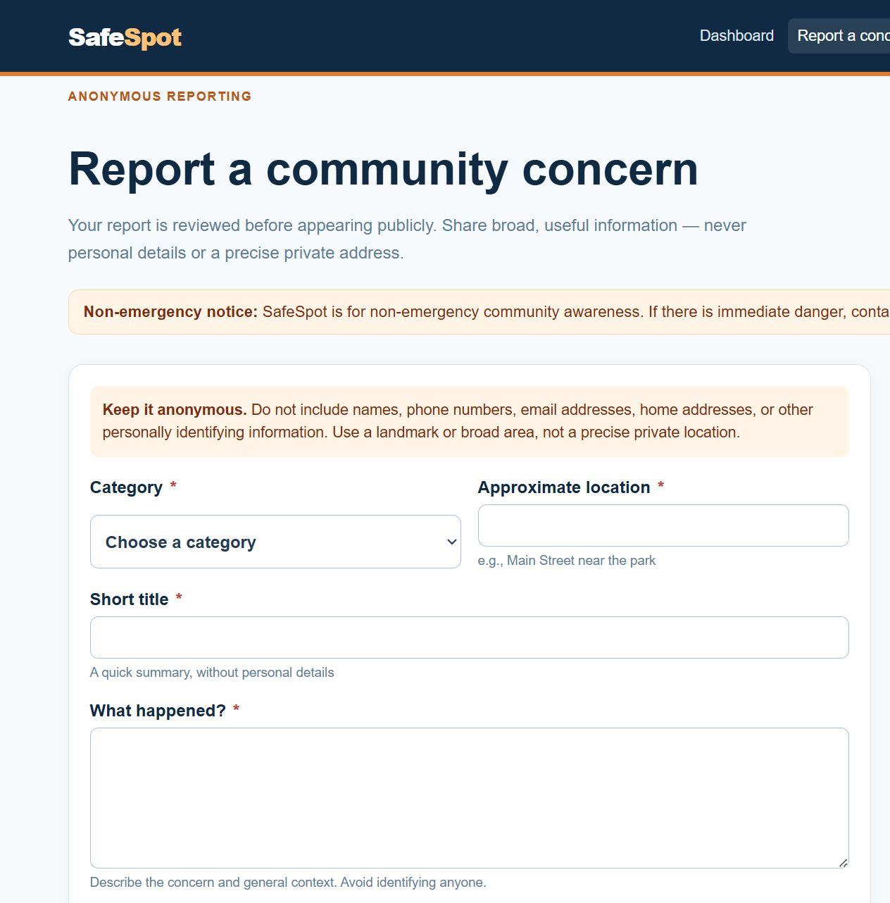
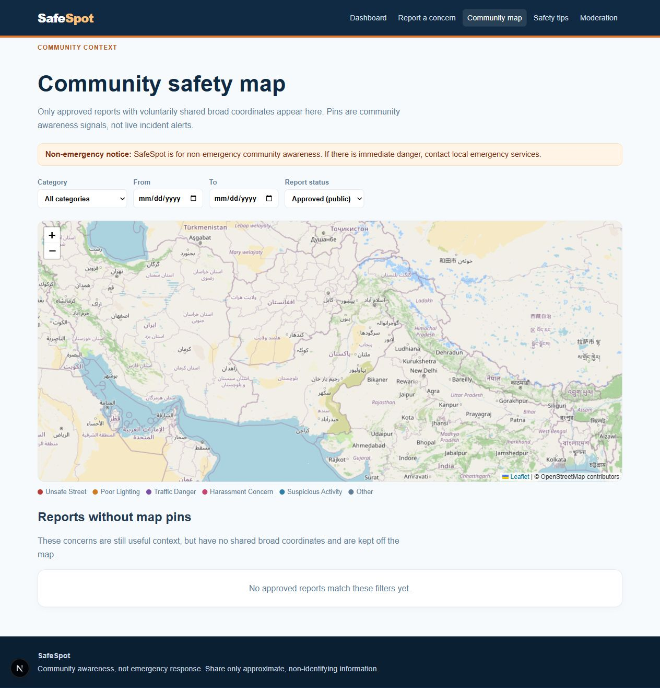

# SafeSpot

SafeSpot is a small community-awareness platform for reporting everyday safety concerns without turning them into public emergencies. It is for things people often notice but do not always have a simple place to share: a dark street, a difficult crossing, a damaged road, or an area that feels unsafe after dark.

The goal is simple: help people notice patterns in their neighbourhood while keeping the person reporting safe and anonymous.

**Live frontend:** [Open SafeSpot](https://safespot-frontend-sigma.vercel.app)

> SafeSpot is not for emergencies. If someone is in immediate danger, they should contact local emergency services.

> This public link is a frontend preview. The FastAPI service remains local until a backend host is connected, so submitting and loading live report data is not enabled in the preview yet.

## Why I built it

Safety information is useful, but it can easily become invasive or alarming. SafeSpot tries to strike a better balance. A report is shared with a broad location, not a private address. It is reviewed before appearing publicly. And the platform does not ask for names, phone numbers, email addresses, accounts, or live location.

It is designed as a calm, practical tool for community awareness rather than a real-time alert system.

## What you can do

- Share a concern anonymously using a short, guided form.
- Browse approved community reports on an OpenStreetMap map.
- See simple trends and category summaries on the dashboard.
- Read practical safety guidance for everyday situations.
- Review, approve, hide, or reject reports in the admin moderation area.

## Screenshots

### Dashboard



### Report a concern



### Community map



## Privacy comes first

SafeSpot keeps reporting deliberately simple and careful:

- No sign-up or personal profile is required.
- Contact details and exact street/home addresses are rejected.
- Coordinates are optional and rounded to broad, block-level precision.
- New reports stay private until an administrator approves them.
- Only approved reports are visible on the dashboard and map.

## Running it locally

You only need Python 3.10+ and Node.js 20+.

```powershell
# Terminal 1 — API
cd backend
python -m venv .venv
.\.venv\Scripts\Activate.ps1
pip install -r requirements.txt
Copy-Item .env.example .env
uvicorn app.main:app --reload
```

```powershell
# Terminal 2 — website
cd frontend
Copy-Item .env.example .env.local
npm install
npm run dev
```

Open `http://localhost:3000` when both services are running. To use the moderation page, set a strong `ADMIN_PASSWORD` in `backend/.env`.

## Built with

Next.js, React, CSS Modules, FastAPI, SQLAlchemy, SQLite, Leaflet, and OpenStreetMap.
